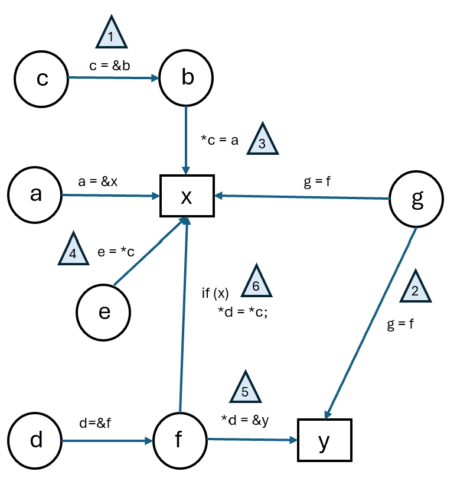

## Complex Pointer Samples Explanation

This image is the points-to graph for the `complex-pointer-types.c` test

x and y are stack allocated abstract locations

This test represents all six pointer types from the class notes:
1. **y = &x**
2. **y = x**
3. **\*y = x**
4. **y = \*x**
5. **\*y = &x**
6. **\*y = \*x**

